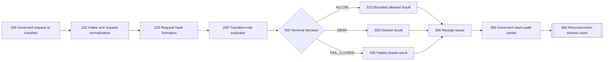
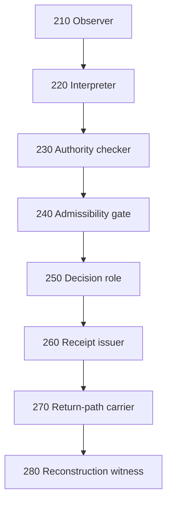
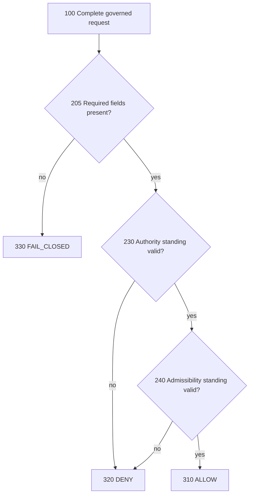
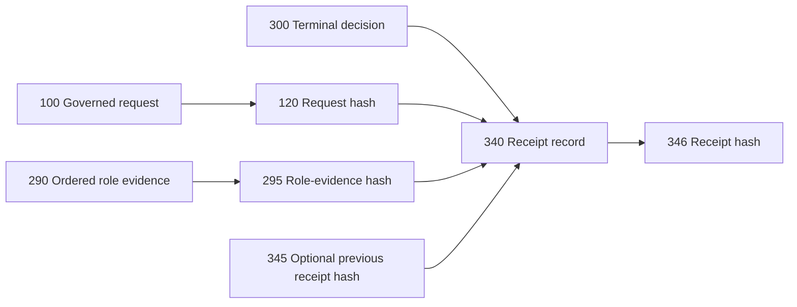
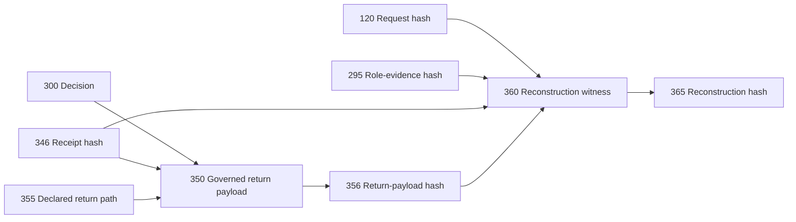
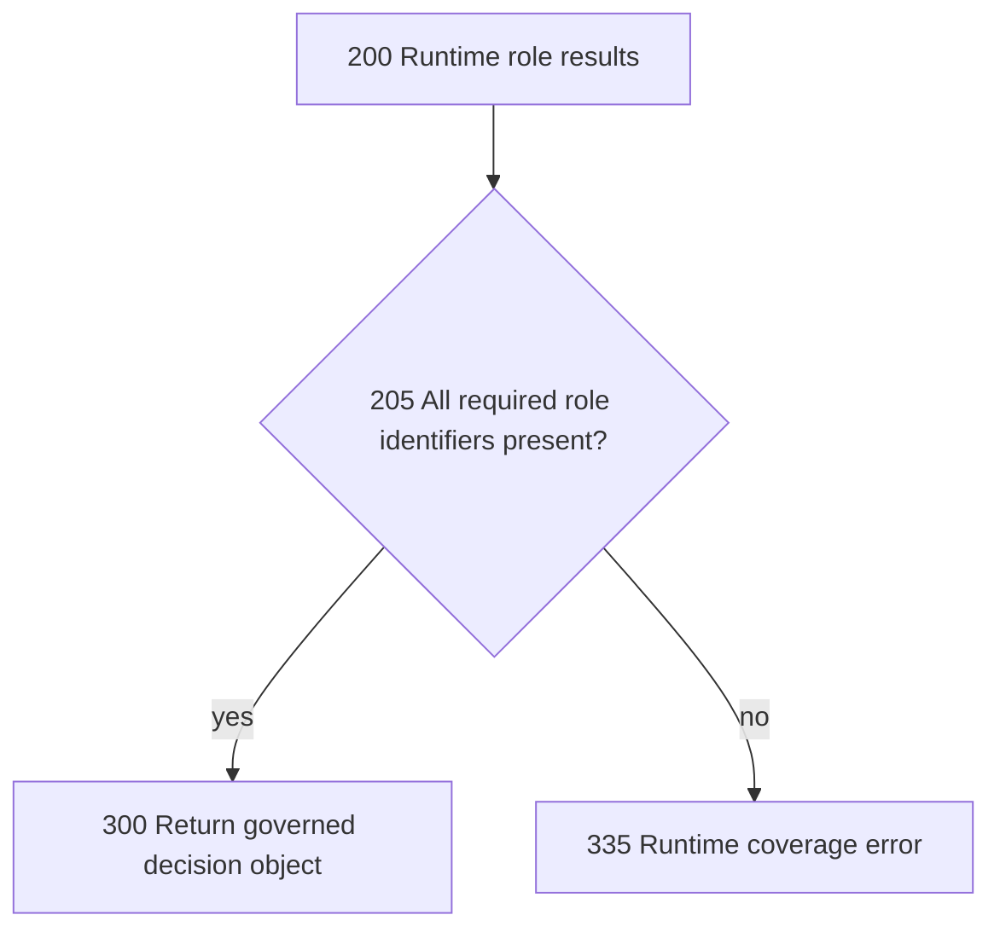
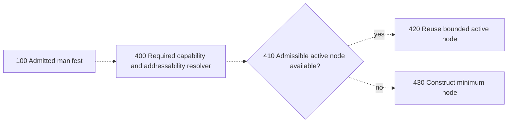
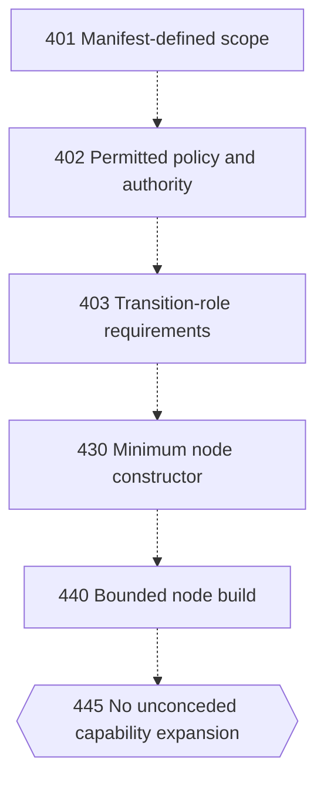
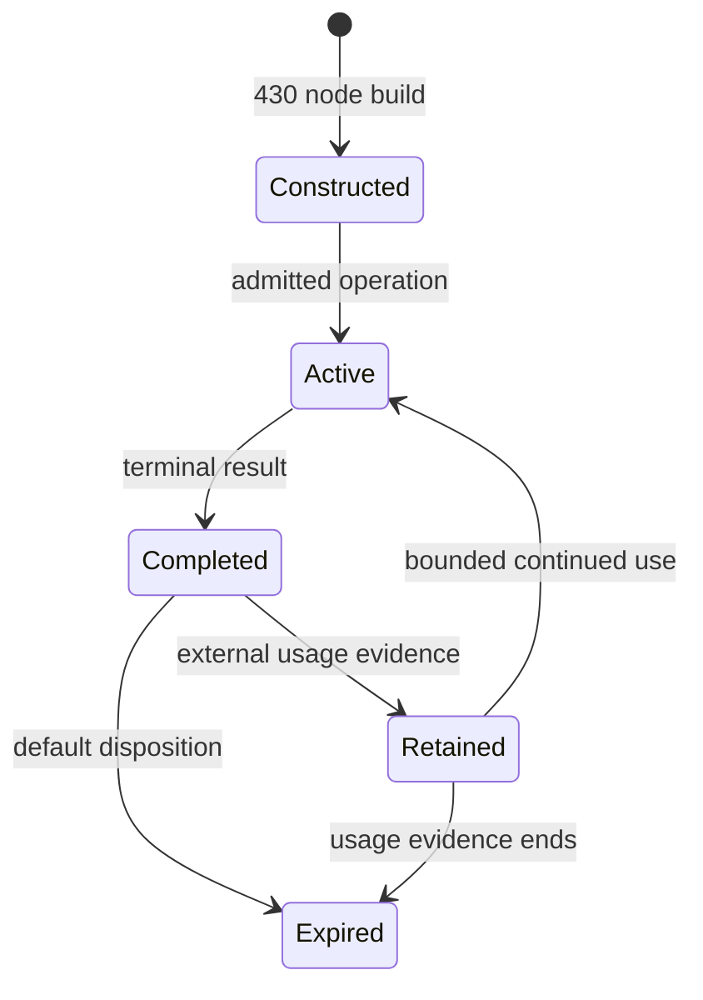
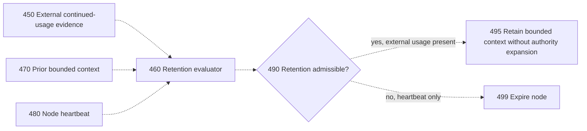

# PAT-001 Formal Drawing Sheets — Working Source

**Patent family:** PAT-001 — Transition-Table-Native Dynamic Micro-Node Computing

**Status:** provisional drawing source for technical and counsel review; not USPTO-formatted drawings and not evidence of filing.

## Drawing conventions

- Solid arrows represent verified data, decision, receipt, or reconstruction flow.
- Dashed arrows represent proposed, conditional, or not-yet-corroborated transitions.
- Double-bordered nodes represent independently governed systems or durable witness stores.
- Reference numerals in the 100 series identify request and intake components.
- Reference numerals in the 200 series identify transition-role components.
- Reference numerals in the 300 series identify decision, receipt, return, and reconstruction components.
- Reference numerals in the 400 series identify proposed capability-resolution, construction, expiry, and retention components that require further corroboration.

## FIG. 1 — Governed micro-node system overview

**Support posture:** verified by the July 2 runtime implementation for request hashing, ordered role execution, terminal decisions, receipt generation, governed return, and reconstruction witness production.

## FIG. 2 — Ordered transition-role sequence

**Support posture:** verified by the required-role declarations and runtime coverage checks.

## FIG. 3 — Authority and admissibility decision boundary

**Support posture:** verified by distinct delegation/authority and policy/admissibility checks in the runtime evaluator.

## FIG. 4 — Receipt binding structure

**Support posture:** verified by deterministic receipt generation and receipt-determinism validation.

## FIG. 5 — Governed return and reconstruction witness

**Support posture:** verified by runtime return-path and reconstruction-witness components.

## FIG. 6 — Required-role completeness enforcement

**Support posture:** verified by the runtime role-coverage check that rejects incomplete role sets.

## FIG. 7 — Proposed active-node capability resolution

**Support posture:** claim refinement requiring canonical implementation evidence before it is treated as reduced to practice.

## FIG. 8 — Proposed minimum-addressability construction

**Support posture:** conception and claim-refinement material; executable enforcement evidence remains required.

## FIG. 9 — Proposed expiry and usage-evidenced retention

**Support posture:** default expiry and usage-only delayed retention require corroboration and executable evidence.

## FIG. 10 — Proposed bounded context reuse and anti-self-retention rule

**Support posture:** claim refinement. Heartbeat non-self-retention and bounded-context reuse remain unsupported by a mapped executable implementation.

## Reference numeral index

| Numeral | Component |
|---|---|
| 100 | governed request or manifest |
| 110 | intake and request normalization |
| 120 | request hash formation or request hash |
| 200 | transition-role evaluator or role-result set |
| 205 | completeness decision |
| 210 | observer role |
| 220 | interpreter role |
| 230 | authority checker |
| 240 | admissibility gate |
| 250 | decision role |
| 260 | receipt issuer role |
| 270 | return-path carrier role |
| 280 | reconstruction witness role |
| 290 | ordered role evidence |
| 295 | role-evidence hash |
| 300 | terminal decision |
| 310 | ALLOW result |
| 320 | DENY result |
| 330 | FAIL_CLOSED result |
| 335 | role-coverage runtime error |
| 340 | receipt issuer or receipt record |
| 345 | previous receipt hash |
| 346 | receipt hash |
| 350 | governed return payload or return carrier |
| 355 | declared return path |
| 356 | return-payload hash |
| 360 | reconstruction witness |
| 365 | reconstruction hash |
| 400 | capability and addressability resolver |
| 401 | manifest-defined scope |
| 402 | permitted policy and authority |
| 403 | transition-role requirements |
| 410 | active-node availability decision |
| 420 | bounded active-node reuse |
| 430 | minimum node constructor or node build |
| 440 | bounded node build |
| 445 | no unconceded capability expansion boundary |
| 450 | external continued-usage evidence |
| 460 | retention evaluator |
| 470 | prior bounded context |
| 480 | node heartbeat |
| 490 | retention admissibility decision |
| 495 | bounded context retention without authority expansion |
| 499 | node expiry |

## Drawing completion requirements

1. Render FIGS. 1–6 as monochrome review drawings.
2. Do not rely on FIGS. 7–10 as reduction-to-practice evidence until their underlying implementations are mapped.
3. Ensure every reference numeral used in a filing version appears in the detailed description.
4. Remove repository-specific names from broad filing figures unless needed for a concrete embodiment.
5. Review line weight, page margins, legibility, and reference-numeral consistency before any filing packet is authorized.
6. Preserve the distinction between verified flow and proposed flow in every derivative format.
