# PAT-005 Formal Drawing Sheets — Working Source

**Status:** provisional drawing source; not USPTO-formatted drawings

## Drawing Conventions

- Solid arrows represent data or evidence flow.
- Dashed arrows represent proposed or review-only transitions.
- Double borders represent independently governed repositories or destination systems.
- A stop marker represents a non-authorizing boundary.
- Receipt identifiers are shown adjacent to the transition they evidence.

## FIG. 1 — End-to-End Governed Device Continuity System

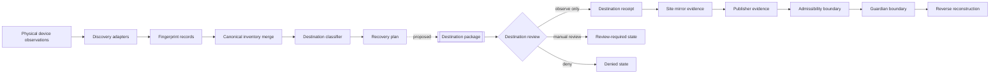

## FIG. 2 — Multi-Transport Observation and Fingerprint Formation

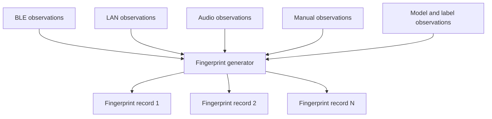

## FIG. 3 — Canonical Inventory Merge with Source Lineage

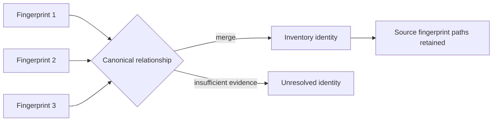

## FIG. 4 — Destination Classification with Preserved Ambiguity

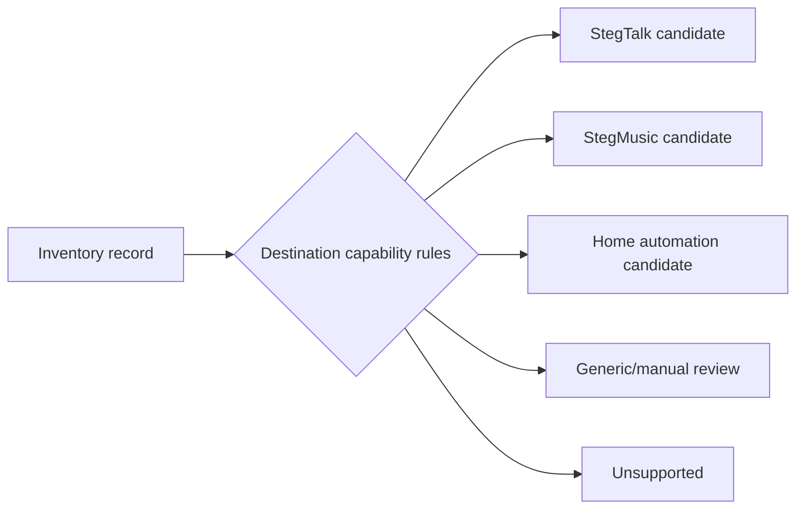

## FIG. 5 — Recovery Plan and Authority Separation

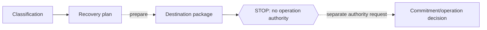

## FIG. 6 — Destination Package Structure

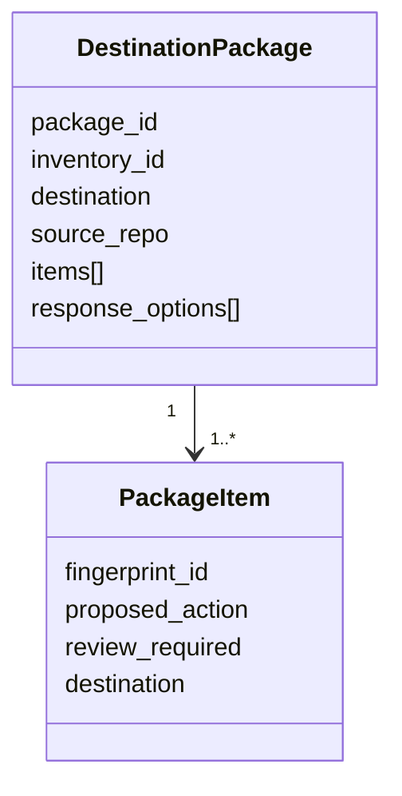

## FIG. 7 — Independent Destination Response

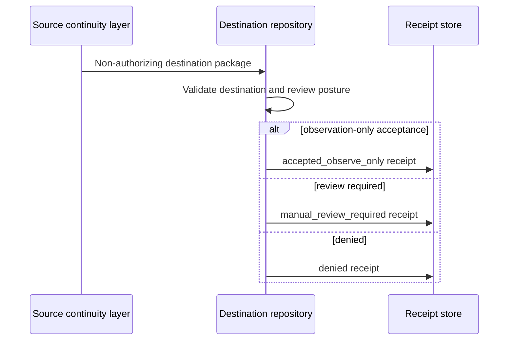

## FIG. 8 — Cross-Repository Evidence Propagation

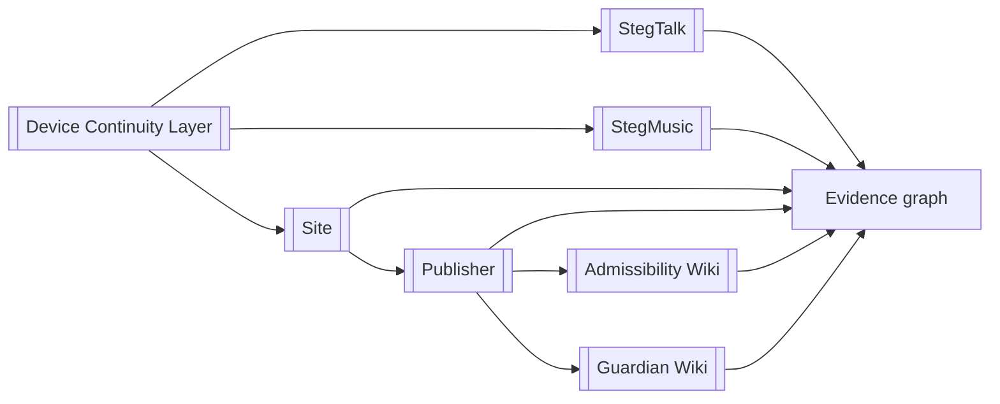

## FIG. 9 — Descriptor-Driven Release Publication

## FIG. 10 — Reverse Reconstruction

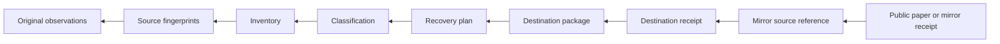

## FIG. 11 — Authority State Separation

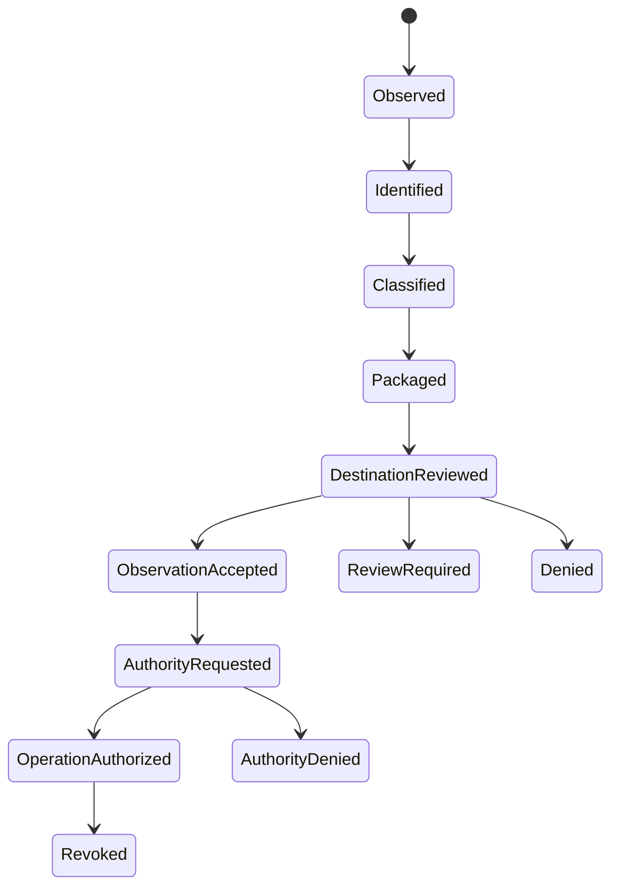

## FIG. 12 — Failure and Non-Inference States

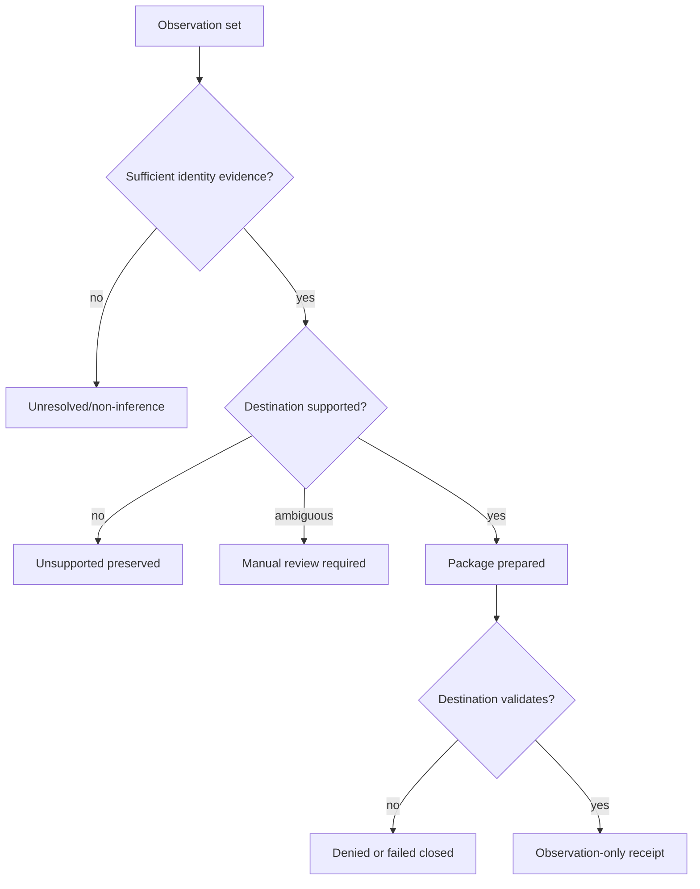

## Drawing Completion Tasks

1. Convert each working sheet into monochrome line drawings with reference numerals.
2. Ensure every reference numeral is described in the specification.
3. Remove implementation-specific names from broad figures where broader support exists.
4. Add device, processor, memory, interface, and data-store components to system figures.
5. Add at least one concrete StegTalk and StegMusic embodiment sheet.
6. Obtain practitioner review before relying on these as filing drawings.
